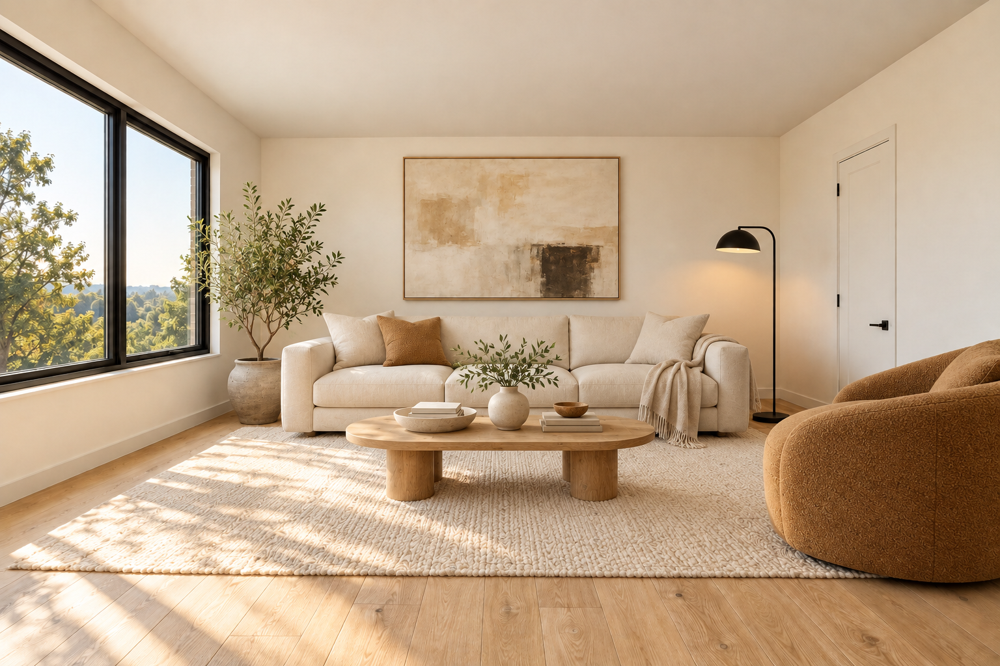

# Mekan AI

**Boş otaqdan dizayna, dizayndan sifarişə.** Azərbaycan dilində ev, ofis və yaradıcı studiyalar üçün AI interyer dizaynı və mebel kəşfi startup prototipi.



İstifadəçi otaq şəklini yükləyir, üslub və büdcə seçir, AI dizaynı yaradır. Nəticədə mebelin üzərinə gələndə **şəklin üzərində** oxşar kataloq məhsulu, AZN qiyməti və satıcı kartı açılır. Məhsul səbətə əlavə edilir, mağazaya sifariş sorğusu və dizaynerə layihə brifi göndərilir.

## Ən sürətli baxış — AI tokeni və baza olmadan

Node.js 24+ tələb olunur.

```sh
npm ci
cp .env.example .env
npm run db:generate
npm run dev
```

`http://localhost:3000` — startup əsas səhifəsi; `http://localhost:3000/examples` — ev/ofis/studiya nümunələri və şəkildə hover kartları. Yeni brauzer sessiyasında bu iki səhifə PostgreSQL və HF tokeni olmadan açılır. Səbət, şəxsi layihə, sifariş və dizayner müraciəti üçün aşağıdakı tam quraşdırmanı edin.

Hazır nümunələr əvvəlcədən AI ilə yaradılıb; canlı generasiya nəticəsi kimi göstərilmir. Məhsul, qiymət və satıcı nümunələri demo kimi işarələnir. Nümunə mebel sahələri əl ilə yoxlanıb; canlı nəticələrdə avtomatik detector işləyir. [Nümunələrin mənbəyi və promptları](docs/DEMO_ASSETS.md).

## Tam demo — baza, səbət, sifariş və dizayner

Docker Desktop işlək olmalıdır. Əvvəl yuxarıdakı `npm ci` addımını yerinə yetirin.

```sh
npm run demo:setup
npm run demo
```

`demo:setup` çatışmayan `.env` faylını yaradır, mövcud bazanı istifadə edir və ya yalnız PostgreSQL konteynerini başladır, əlavəedici miqrasiyaları tətbiq edir və nümunə kataloq, dizayner və üç hazır layihə yaradır. Baza artıq qurulubsa: `npm run demo:setup -- --existing-db`.

`demo` worker və tətbiqi başladır, Chrome/Playwright brauzerində demo müştəri hesabı ilə nümunələri və studiyanı açır. Chrome yoxdursa əvvəl `npx playwright install chromium` işlədin. Demo şifrəsi `.env` daxilində `SEED_DEMO_PASSWORD` sətrindədir; ən azı 12 simvol tələb olunur. Boş şifrə setup zamanı avtomatik yaradılır. Demo hesabları:

- `customer@demo.mekan.test` — layihə, səbət və sifariş.
- `store_owner@demo.mekan.test` — mağazaya daxil olan sifariş və sorğular.
- `designer@demo.mekan.test` — layihə ilə dizayner müraciətləri.
- `admin@demo.mekan.test` — moderasiya və idarəetmə.

Nümunədə **“Layihəni aç və seç”** və ya **“Nümunəni layihə kimi aç”** seçin. Şəxsi layihədə hover kartından mebeli səbətə əlavə edin və sifariş sorğusu göndərin. Həmin səhifədə “Bu dizaynı kim həyata keçirə bilər?” bölməsindən dizaynerə müraciət edin. Ödəniş gateway-i yoxdur; sifariş və müraciətlər real PostgreSQL qeydləridir.

## Canlı pulsuz AI

[Pulsuz Hugging Face hesabı](https://huggingface.co/join) və [access token](https://huggingface.co/settings/tokens) yaradın. Tokeni yalnız `.env` faylında saxlayın:

```dotenv
AI_PROVIDER=huggingface
HF_TOKEN=your_hugging_face_token
ALLOW_PAID_AI=false
PAID_AI_ENABLED=false
```

Rəsmi [Qwen Image Edit Space-i](https://huggingface.co/spaces/Qwen/Qwen-Image-Edit) şəkil + prompt ilə çağırılır. Billed Inference Providers API-si və ödənişli alternativ istifadə edilmir. [Pulsuz ZeroGPU istifadəsində kvota və növbə məhdudiyyətləri var](https://huggingface.co/docs/hub/spaces-zerogpu); servis işləməsə xəta göstərilir, hazır nümunə yeni nəticə kimi əvəz edilmir. Real ev/ofis/studiya şəkillərində keyfiyyət ayrıca yoxlanmalıdır. Tətbiq və worker tokeni əlavə etdikdən sonra yenidən başladılmalıdır:

```sh
npm run dev
# Ayrı terminalda:
npm run worker
```

Brauzer ünvanı `.env` daxilində `APP_URL` ilə eyni origin olmalıdır. İlk setup nümunələrdə `http://localhost:3000` istifadə edir. Şəkillər xarici Qwen xidmətinə göndərilir; şəxsi yaddaş və tətbiqdə giriş icazələri qorunur.

### Canlı nəticədə avtomatik mebel aşkarlama

Python 3.11+ üçün virtual mühit və pulsuz açıq Grounding DINO modelini hazırlayın. Mac/Linux:

```sh
python3 -m venv .local-ai/venv
.local-ai/venv/bin/python -m pip install -r local_ai/detection-requirements.txt
npm run ai:detect:prepare
```

Windows-da virtual mühitin Python yolu `.local-ai/venv/Scripts/python.exe` olur; pip əmrində həmin yolu istifadə edin. Worker bu yolu avtomatik seçir, yaxud `DETECTOR_PYTHON` ilə təyin etmək olar.

Şəkil generasiyası tamamlananda dərhal saxlanılır. Worker ayrıca mebeli aşkarlayır, koordinatları və oxşar aktiv kataloq məhsullarını bazada saxlayır. Analiz alınmasa şəkil itmir; “Mebelləri analiz et” ilə yenidən cəhd etmək olur. Detector model çəkiləri əvvəlcədən endirilir; şəkil analizi lokal aparılır.

## Texnologiya və yoxlama

Next.js 16 / React 19, TypeScript, PostgreSQL / Prisma, məxfi lokal və ya S3 şəkil yaddaşı, davamlı generasiya və analiz növbəsi. 2D redaktor MVP-dən çıxarılıb; köhnə saxlanmış məlumatlar silinmir.

```sh
npm run lint
npm run typecheck
npm test
npm run build
npm run test:public
# Qurulmuş development/test bazası ilə, worker-i dayandırdıqdan sonra:
npm run test:integration
npm run test:e2e
```

[Hakaton ssenarisi](docs/HACKATHON.md) · [Cari yoxlama vəziyyəti](docs/AI_DEMO_VERIFICATION.md) · [Arxitektura](docs/ARCHITECTURE.md).

GitHub Actions lokal unit/integration/brauzer axınlarını yoxlayır; canlı xarici AI çağırışı etmir. Heç bir API açarı, `.env`, şəxsi şəkil, model çəkisi və lokal baza repoya daxil edilmir.
